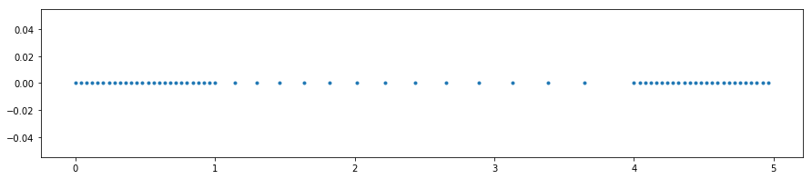
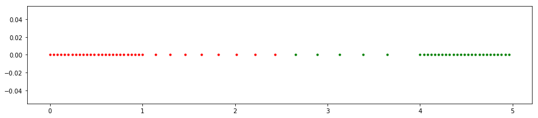
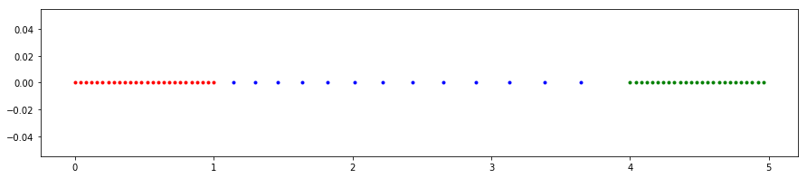
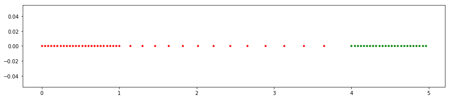
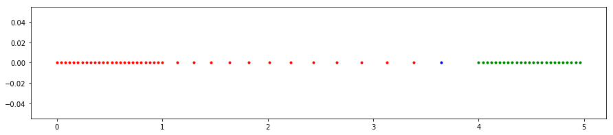

# Алгоритм single-link clustering для точек на прямой
Описание алгоритма:  
1. Сортируем точки  
2. Создаем массив соседних пар точек, сортируем его по возрастанию дистанции между точками  
3. Затем проходим по массиву пар и объединяем кластеры, к которым принадлежат точки из пары.  

Для того, чтобы эффективно находить кластер, к которому принадлежит точка из пары, для каждой точки храним индекс корневого кластера, а для каждого кластера храним индекс самой левой и самой правой точек, принадлежаших ему. Во время прохода по парам, обновляем информацию.

Пусть N - количество данных точек, тогда алгоритм будет делать две сортировки N элементов за O(N log N), а затем проход по соседним парам точек, число которых N-1. Итоговое время работы алгоритма O(N log N)  

Пример работы:  
Ввод:  
> 2.3 1 4 50 49 2 9  

Вывод (номера кластера и точка, либо номер кластера и номера дочерних кластеров):  
>0: 2.3  
>1: 1  
>2: 4  
>3: 50  
>4: 49  
>5: 2  
>6: 9  
>7:  5 0  
>8:  1 7  
>9:  4 3  
>10:  8 2  
>11:  10 6  
>12:  11 9  

# "Плохой" пример
Рассмотрим набор точек:    

Ожидаемое разделение на два кластера:

Ожидаемое разделение на три кластера:

Однако предложенный алгоритм дает совсем другие результаты.  
Два самых верхних в иерархии кластера получатся следующие, что не является желаемым разделением:  

При рассмотрении трех самых верхних кластеров, одна, самая правая красная точка образует отдельный кластер, что так же не является ожидаемым разделением на три кластера.

